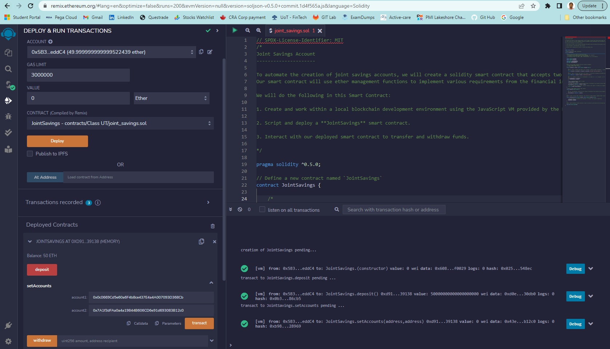
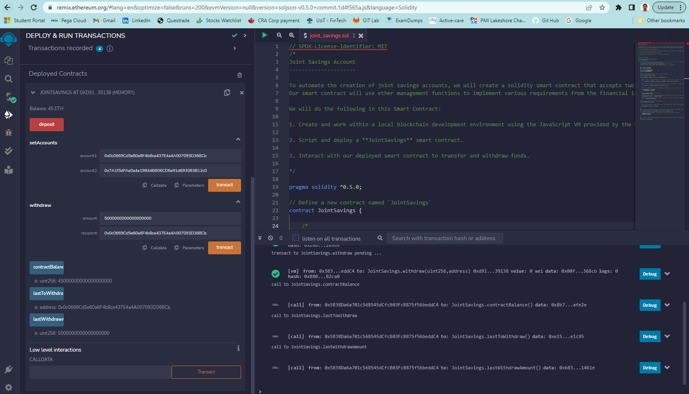
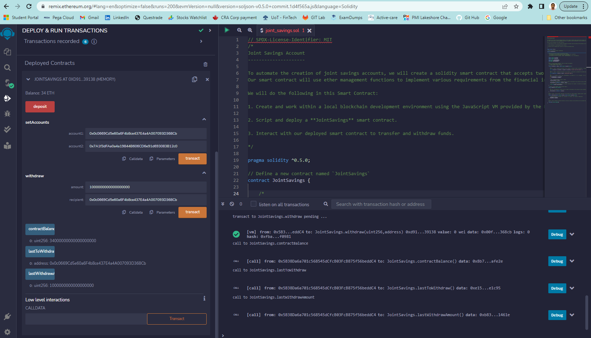

# solidity_smart_contract

Build a smart contracts to automate many of the institutions’ financial processes and features.

 
Here, to automate the creation of joint savings accounts, we will create a solidity smart contract that accepts two user addresses that are then able to control a joint savings account. 

Our smart contract will use ether management functions to implement various requirements from the financial institution to provide the features of the joint savings account.

We will do the following in this Smart Contract:

1. Create and work within a local blockchain development environment using the JavaScript VM provided by the Remix IDE.

2. Script and deploy a **JointSavings** smart contract.

3. Interact with our deployed smart contract to transfer and withdraw funds.

 
Using the setAccounts function to define the authorized Ethereum address that will be able to withdraw funds from our contract. 

We used the following Ethereum addresses:

    Dummy account1 address: 0x0c0669Cd5e60a6F4b8ce437E4a4A007093D368Cb
    Dummy account2 address: 0x7A1f3dFAa0a4a19844B606CD6e91d693083B12c0

 

After successfully depositing 50 ether as initial funds into our contract, to test the contract’s withdrawal functionality we perfromed 3 transactions by withdrawing:

    Transaction 1: 5 ether into accountOne 
    Transaction 2: 10 ether into accountTwo
    Transaction 3: 1 ether into accountOne

After each transaction, use the contractBalance function to verify that the funds were withdrawn from your contract. Also, we use the lastToWithdraw and lastWithdrawAmount functions to verify that the address and amount were correct.

 

Transaction 1: 5 ether into accountOne - 0x0c0669Cd5e60a6F4b8ce437E4a4A007093D368Cb

Transaction 2: 10 ether into accountTwo - 0x7A1f3dFAa0a4a19844B606CD6e91d693083B12c0

Transaction 3: 1 ether into accountOne - 0x0c0669Cd5e60a6F4b8ce437E4a4A007093D368Cb

